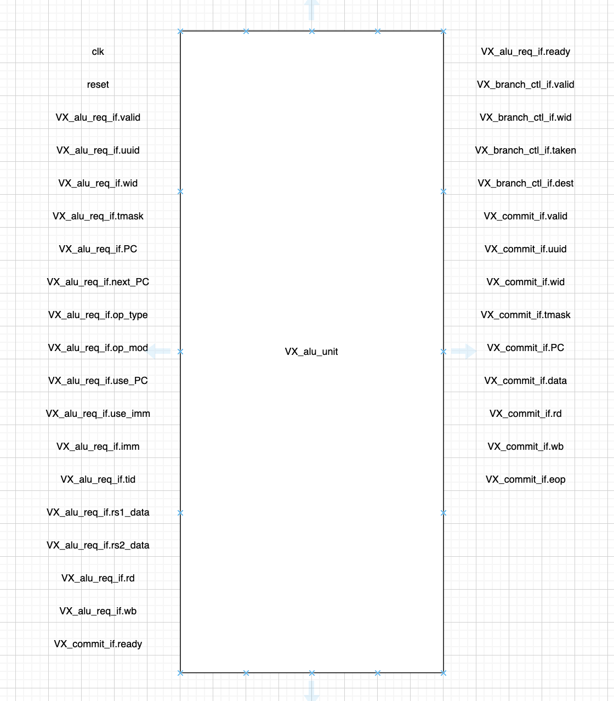

# block_diagram_generator
Generate drawio blocks for system verilog modules

1. Commit 1: Extract the signals from module and interface  
2. Commit 2: Update readme file  
3. Commit 3: bugfix + generates drawio xml file with module and signal names arranged  
4. Commit 4: Connect the signals to module  
5. To do: Fix text autosizing

Generates the drawio file as shown below,



## Configure variables in main.py  
INPUT_FILE: module .sv file  
INTERFACE_PATH:  interface files directory   

```
python main.py
```
  extracts the signals and store it in input and output signals list  
  prints signals type, size, name on terminal
